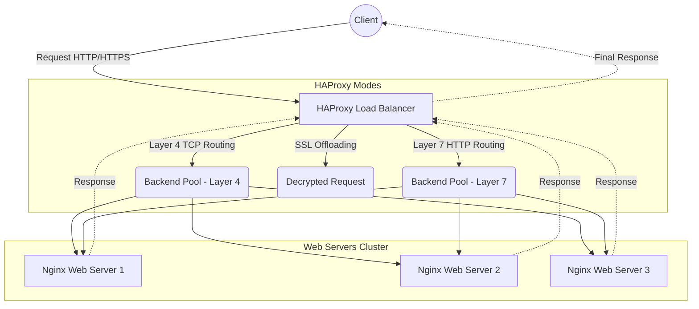

# 🚀 High Availability Proxy (HAProxy) Load Balancer System

<div align="center">
  
  
  
  
</div>

## 1. Description
A multi-layer Load Balancing system utilizing **HAProxy** deployed via **Docker** and **Docker Compose**. This project provides a sophisticated load-balancing architecture operating at both **Layer 4 (TCP)** and **Layer 7 (HTTP/HTTPS)** of the OSI model, ensuring high availability and optimized traffic distribution for the Backend Web Servers cluster.

## 2. Introduction
This project was developed to illustrate a practical approach to Load Balancer deployment. In general, having a load-balancing proxy helps the system eliminate Single Points of Failure, distribute overloads evenly, and easily monitor system health.

The simulated environment includes:
- **HAProxy**: Operates as a Container managing traffic forwarding.
- **Web Servers**: 3 Nginx (Alpine) containers serving as the backend to handle user requests. All web servers are built from a **single shared template** (`nginx-webserver/`) using environment variables, following the DRY principle.

## 3. Key Features
- **⚡ OSI Layer 4 Load Balancing (TCP/Transport):** Load balancing at the Transport level, minimizing latency, suitable for high-volume traffic.
- **🌐 OSI Layer 7 Load Balancing (HTTP/Application):** Load balancing at the Application level, distributing HTTP requests and inspecting header/URL content.
- **🔒 SSL/TLS Termination:** Manages digital certificates using HAProxy, encrypting external traffic and offloading security processing for Web Servers.
- **🛡️ Access Control Lists (ACL):** Establishes rules to control and route traffic based on specific criteria.
- **🔄 Round Robin Algorithm:** Implements the Round Robin algorithm to fairly rotate requests among Nginx nodes.
- **📊 HAProxy Stats Dashboard:** Provides an integrated visual statistics dashboard for monitoring status, bandwidth, and error rates.
- **⚕️ Health Checks:** Auto-detects backend status, isolates disconnected nodes, and automatically re-adds them upon recovery.

## 4. Overall Architecture



## 5. Installation

Minimum environment requirements:
- [Docker](https://docs.docker.com/get-docker/) (v20.10.x or higher)
- [Docker Compose](https://docs.docker.com/compose/install/) (v2.x)
- Git

Clone the project to your local machine:
```bash
git clone https://github.com/your-username/your-repo.git
cd your-repo
```

## 6. Running the project

The project has 3 deployment options. Choose your preferred deployment method.

### Option A: Layer 4 Load Balancing (TCP)
```bash
cd Layer4
docker compose up -d --build
```
Access at: `http://localhost:8081`

### Option B: Layer 7 Load Balancing (HTTP)
```bash
cd Layer7
docker compose up -d --build
```
Access at: `http://localhost:8080`

### Option C: SSL/TLS Termination Proxy
```bash
cd ProxySSL
docker compose up -d --build
```
Access at: `https://localhost:443` | Stats Dashboard: `http://localhost:8080/haproxy_stats/acl` (admin/admin)

### Stop all Containers
```bash
docker compose down
```

## 7. Env configuration
Configuration is centralized in `haproxy.cfg` within each deployment folder. Key parameters you can customize:

| Parameter | Location | Description |
|---|---|---|
| `balance` | `haproxy.cfg` → `backend` | Load balancing algorithm (`roundrobin`, `leastconn`, `source`) |
| `stats uri` | `haproxy.cfg` → `defaults` | Stats dashboard URL path |
| `stats auth` | `haproxy.cfg` → `defaults` | Dashboard credentials |
| `SERVER_NAME` | `docker-compose.yml` | Display name for each web server node |

## 8. Folder structure

```
.
├── nginx-webserver/              Shared web server template (DRY)
│   ├── Dockerfile                Nginx Alpine image
│   ├── entrypoint.sh             Dynamic HTML generator via ENV vars
│   └── Logo_UIT_updated.svg      UIT Logo asset
│
├── Layer4/                       Layer 4 TCP Load Balancing
│   ├── docker-compose.yml        3 web nodes + HAProxy (TCP mode)
│   └── haproxy.cfg               TCP frontend/backend config
│
├── Layer7/                       Layer 7 HTTP Load Balancing
│   ├── docker-compose.yml        3 web nodes + HAProxy (HTTP mode)
│   └── haproxy.cfg               HTTP frontend/backend config
│
├── ProxySSL/                     SSL/TLS Termination + Stats
│   ├── docker-compose.yml        3 web nodes + HAProxy (HTTPS mode)
│   ├── haproxy.cfg               SSL + HTTP redirect + stats config
│   └── certs/
│       └── haproxy-cert.pem      Self-signed SSL certificate
│
├── .gitignore
└── README.md
```

## 9. Contribution guidelines
We welcome all contributions to improve the system:
1. Fork the Project
2. Create your Feature Branch (`git checkout -b feature/AmazingFeature`)
3. Commit your Changes (`git commit -m 'Add some AmazingFeature'`)
4. Push to the Branch (`git push origin feature/AmazingFeature`)
5. Open a Pull Request

## 10. License
Distributed under the MIT License. See `LICENSE` for more information.

## 11. Roadmap
- [ ] Add Least Connection load balancing algorithm
- [ ] Set up Firewall and Rate Limiter with HAProxy for DDoS prevention
- [ ] Automate Linux OS setup with shell scripts
- [ ] Integrate Prometheus and Grafana for advanced monitoring and metrics
